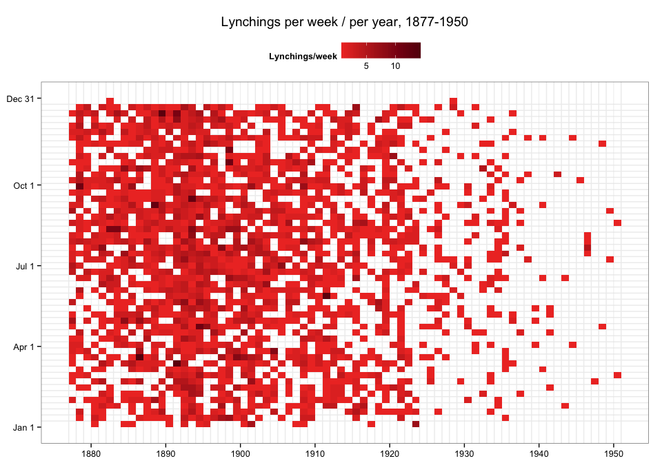
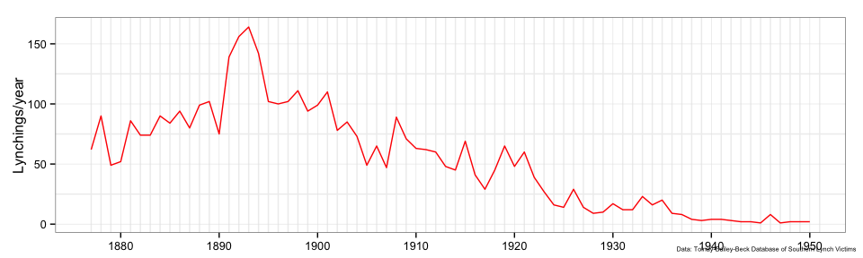
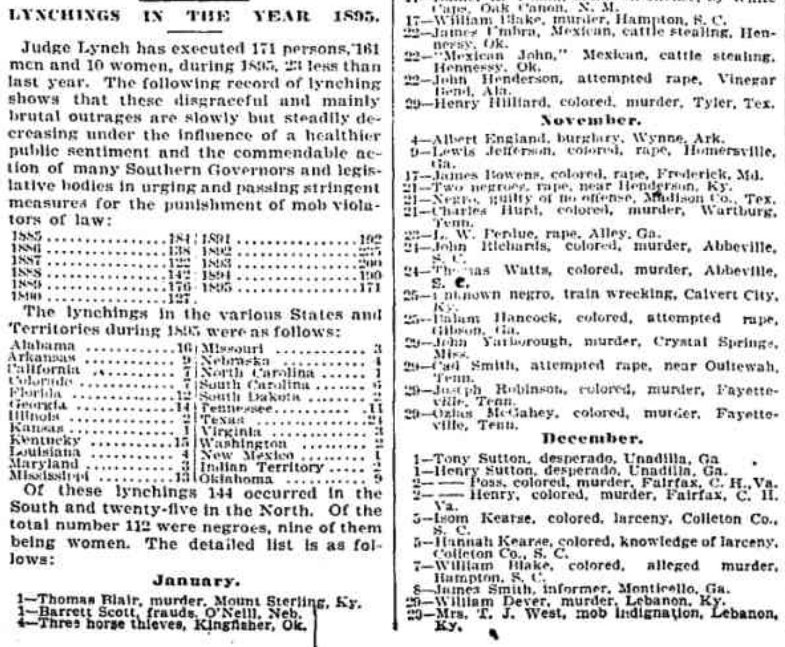
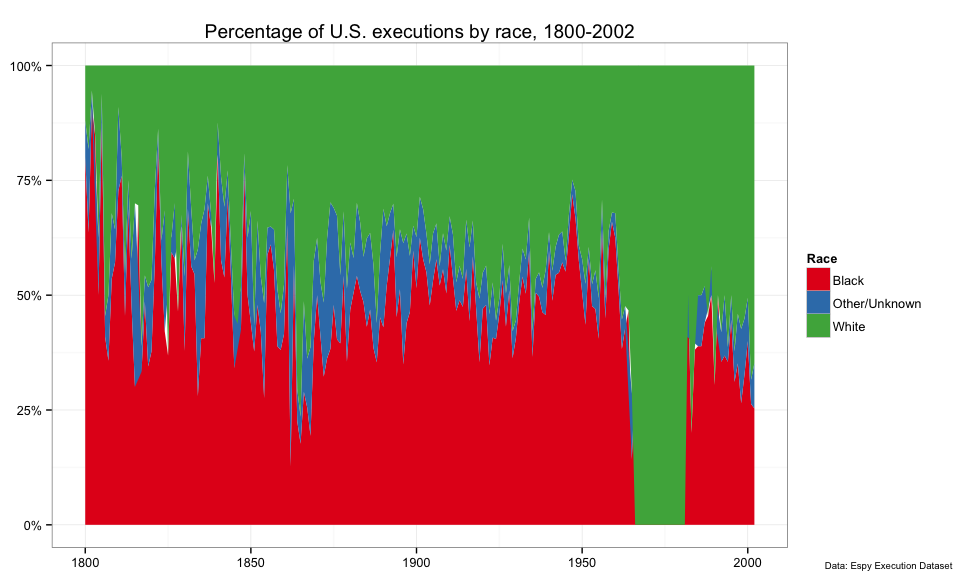
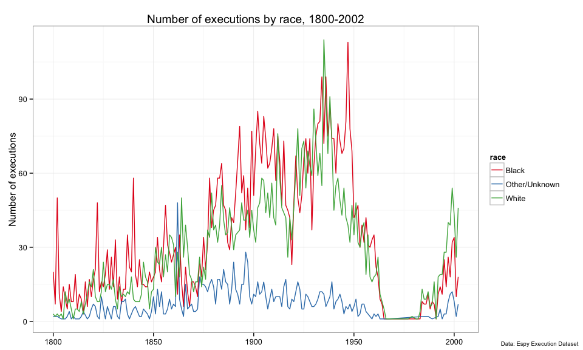

---
author: 'Lincoln A. Mullen'
author-first: 'Lincoln A.'
author-last: Mullen
author-note: 'Lincoln Mullen is an assistant professor in the Department of History and Art History at George Mason University.'
layout: article
title: 'Lynching, Visualization, and Visibility'
vol: 17
year: 2015
...

In "The Southern Rite of Human Sacrifice," Donald Mathews argues that lynching can be understood as a religious ritual, a symbolic act as pregnant with religious meaning as with political meaning.[^1] Lynching made visible the power structures of southern society. All rituals hold forth symbols that make the invisible visible. But in the case of lynching, *making visible* was as literal as it was symbolic: crowds of people watched as they hanged or burned other people, and then those mobs distributed postcards in which they posed with their victims.

It is this concept of *visiblity* that I wish to explore in reading Mathews's article from the perspective of digital history. To state the argument briefly: One form of digital history is concerned with questions of data visualization, though it is not at all obvious that this historical method shares anything in common with Mathews's approach.[^2] In fact, Mathews turns away from the empirical and quantitative methods most akin to data visualization in history. Yet the methods of historical visualization and of religious studies share some broad similarities in their aims and their blindnesses. More important, lynching was visible in the sense that it was a spectacle of power, but it was invisible in the records of the nation-state until anti-lynching activists gathered and publicized the data on lynching that undergirds contemporary scholarship. In that way, there are significant parallels in the way that lynching became publicly visible and the recent increased visibility of police killings in our own day.

In bringing the methods of religious studies to bear on the meaning of lynching, Mathews takes some pains to distance his approach from social historical or social scientific approaches that were concerned with finding "master patterns" in lynchings. Mathews explains that in this literature, especially Stewart E. Tolnay and E. M. Beck's 1995 book *A Festival of Violence*, "the demographics, economics, seasons, and politics of lynching were patterned and correlated statistically to establish trends."[^3] Through statistical analyses and occasionally visualizations, these studies aimed to bring the hidden patterns in the data on lynching to light. Such data-driven studies have continued since Mathews published his article, most recently with the publication of Amy Kate Bailey and Stewart E. Tolnay's *Lynched: The Victims of Southern Mob Violence*.[^4] Where Mathews was theoretical, these studies were empirical. Where Mathews studied southern theology, they studied tables of lynching data. But both methods share a similar vision and a similar blindness. Both try to explain patterns in lynching in order to understand the meaning of lynchings *in the aggregate*.[^5] To achieve that analysis in the aggregate, both methods of study were blunt instruments. Just as a data visualization reveals the pattern of the points plotted more readily than it reveals the people behind those data points, so Mathews does not describe any specific lynchings. He writes that "the lynchings assumed here are generic with the justifying myth of immaculate protection behind them and with the implication of just punishment for the violation of innocence."[^6]

Let us consider some of the simplest possible visualizations of lynching data. My point here is not to undertake an analysis of data about lynching that can stand on its own, but instead to point out the primary way in which those visualizations can function to make visible the patterns of lynching, not unlike Mathews's attempt to explain the meaning of lynchings. One pattern discovered by Tolnay and Beck was that there was about one lynching per week for the fifty years from the 1880s through the 1920s.[^7] The chart below attempts to make the pervasiveness of lynchings visible with a grid for each week in each year. Shaded boxes indicate that there was at least one and in some weeks as many as fourteen lynchings; blank boxes indicate the rare week that had no known lynchings; an accompanying line chart shows the total number of lynchings per year. Lynching was present at all times: an unusual moment of terrorism whose power was brought home with regularity.

For that matter, lynchings were as regular across space as they were across time. When we map the number of people who were lynched across the South, the pattern of chronological regularity is matched by a pattern of geographic regularity. Nearly every county had its lynching tree, and so lynchings were a spectacle that made white supremacy visible in every place the South.[^8]

#### Lynchings victims per county, 1877--1950

<iframe src="lynching-map.html" style="height:600px;width:100%;border: 1px solid #ccc;"></iframe>

*Data: [Tolnay-Bailey-Beck Database of Southern Lynch Victims](http://lynching.csde.washington.edu/#/home)*.

Such visualizations are possible because of the datasets that have been gathered by scholars over many decades. The most sophisticated of these datasets comes from the Center for Studies in Demography and Ecology at the University of Washington, begun in the 1980s by Tolnay and Beck for their book *A Festival of Violence* and continued most recently by Amy Kate Bailey, Piere Washington, Beck, and others.[^9] Another data set with a similar purpose is [Project HAL: Historical American Lynching Data Collection Project](http://people.uncw.edu/hinese/HAL/HAL%20Web%20Page.htm), based in large part on an earlier version of the Tolnay and Beck collection with additional crowd-sourced contributions.

Yet both of these datasets had their origins in the work of anti-lynching activists. In 1895 Ida B. Wells published her anti-lynching pamphlet *The Red Record: Tabulated Statistics and Alleged Causes of Lynching in the United States*, following up on her earlier pamphlet *Southern Horrors: Lynch Law in All Its Phases* (1892). (Consider where the dates of these pamphlets lie on those charts of lynching frequency above.) In *The Red Record*, the section "Lynching Record for 1894" contains a list of names of lynch victims gathered by the *Chicago Tribune*. [^10] Whatever the *Tribune*'s motives, Wells aimed to provoke a "pronounced awakening of the public conscience" by making the records of lynching known.

*[Chicago Tribune, January 1, 1895](http://archives.chicagotribune.com/1896/01/01/page/22/article/lynchings-in-the-year-1895).*

The efforts of the *Chicago Tribune* and Ida B. Wells were furthered by the Tuskegee Institute. The Tuskegee Institute took earlier lists as a basis for research and painstakingly gathered and verified accounts of lynchings for many decades. This dataset became in turn the source of data for both the CSDE data and Project HAL. The Tuskegee Institute, like Wells, aimed to awaken the public conscience by making the extent of lynching visible in their 1931 map, "[Lynchings by States and Counties in the United States, 1900--1931](http://memory.loc.gov/cgi-bin/map_item.pl?data=/service/gmd/gmd370/g3701/g3701e/ct002012.jp2&itemLink=r?ammem/gmd:@field(NUMBER+@band(g3701e+ct002012))&title=Lynchings+by+states+and+counties+in+the+United+States,+1900-1931+:+(data+from+Research+Department,+Tuskegee+Institute)+;+cleartype+county+outline+map+of+the+United+States.&style=gmd&legend=)."

*Research Department, Tuskegee Institute, "Lynchings by states and counties in the United States, 1900-1931" (New York: American Map County, \[1931?\]): <http://hdl.loc.gov/loc.gmd/g3701e.ct002012>.*

Gathering data, preparing charts, and making maps are, as often as not, techniques of statecraft and of nation-building.[^11] Yet lynching was an unusual because lynch law lay outside the law of the land. Though lynching was basic to white supremacy, its technical extralegality meant that state and federal governments did not gather data on lynchings. The visibility of the lynch victim was matched by his or her invisibility in the records of the nation-state. As Mathews explains, lynching was a ritual that made power visible, yet its power depended in part on its lack of visibility in the official records. For Wells and the Tuskegee Institute, to gather and publish the data on lynching made the crime and injustice of lynching as visible as white supremacy. Mathews cites Ed Ayers to the effect that "black men seized for lynching were often marginal to the communities in which they were sacrificed," but the list of names published in the *Chicago Tribune* or the pages of Wells's writings made them central to the public discourse.

It is in this light that we might consider the judicial and extrajudicial killings of African Americans in the contemporary United States, and the efforts of citizens and newspapers to gather data and visualize it.[^12] Quoting Rene Girard, Matthews writes that "sacrificial rites are 'essential' in 'societies that lack a firm judicial system.'" Yet in the United States the judicial system is firmly set against African Americans who are far more likely to be executed than whites. Despite being a minority of the population, blacks in most years comprise half or more of the people executed in the United States.[^13]

 

But where executions are a matter of public record, extrajudicial killings by police are not. The federal government gathers no official, reliable records of police use of force, and those records that do exist at the federal Justice Department are known to seriously undercount police use of violence. According to one investigation, a comparison of federal records with police departments' own "internal figures show at least 1,800 police killings in those 105 departments between 2007 and 2012, about 45% more than the FBI’s tally for justifiable homicides in those departments’ jurisdictions, which was 1,242."[^14] A series of citizen activists are attempting to create a database of police killings. The most successful of these attempts is [Fatal Encounters](http://www.fatalencounters.org/), which aims to "help create a database of all deaths through police interaction in the United States since Jan. 1, 2000." So far that project has "compiled 7,609 records of people killed through interactions with law enforcement" which they estimate to be only 40 percent of the total.[^15] The recent killings of Eric Garner, Tamir Rice, Michael Brown, Freddie Gray, Walter Scott, Tanisha Anderson, Yvette Smith, and many others do not represent a radical rise in the rate at which black men and women are killed by police, but only an increased prominence of their position in the public discourse.[^16] Police violence against African Americans is everywhere visible on the streets but invisible in the official records.

Lynching was a way of making visible the supremacy of whites while hiding the operation of power from the records of the state. Lynching was made visible to the public (and thus to scholars) in part by making visible the data on lynching. Given the parallels between the ways that the data on lynching and the data on police violence is gathered, we should find that these words from Mathews can explain as much about our own political situation as they do about the southern ritual of human sacrifice:

> The common assumption that in certain commonly understood encounters between blacks and whites, African Americans were always at fault simply by being black made illegal lynching appear to be as legitimate as legal punishment.[^17]

-------------------------------------------------------------------

**Editor's Note:** [Lincoln Mullen](http://lincolnmullen.com) is an assistant professor in the Department of History and Art History at George Mason University. He is currently writing a book titled *The Varieties of Religious Conversion: The Origins of Religious Choice in the United States*.

[^1]: Donald G. Mathews, "The Southern Rite of Human Sacrifice," *Journal of Southern Religion* 3 (2000): [part 1](http://jsreligion.org/mathews.htm), [part 2](http://jsreligion.org/mathews2.htm), [part 3](http://jsreligion.org/mathews3.htm).

[^2]: Data visualization is by no means the only way that digital history might approach the history of lynching. Digital public history, for instance, might have an entirely different approach.

[^3]: Mathews, part 1; Stewart E. Tolnay and E. M. Beck, *A Festival of Violence: An Analysis of Southern Lynchings, 1882-1930* (University of Illinois Press, 1995).

[^4]: Amy Kate Bailey and Stewart E. Tolnay, *Lynched: The Victims of Southern Mob Violence* (University of North Carolina Press, 2015). See also Amy Kate Bailey and Karen A. Snedker, "Practicing What They Preach? Lynching and Religion in the American South, 1890–1929," *American Journal of Sociology* 117, no. 3 (2011): 844–87, doi:10.1086/661985, which undertakes a quantitative study with regression models to show that, counties with more religious diversity or counties with more black controlled churches were likely to have more lynchings.

[^5]: In addition to their studies in the aggregate, Bailey and Tolnay have also done much work in gathering details about individual cases.

[^6]: Mathews does rely on the description of the lynching of Leo Frank: "The lynching of Leo Frank, observed a reporter, was almost 'like some religious rite;' there was a 'curiously reverent manner' and sense of 'grave satisfaction' among the actors." Mathews, part 1.

[^7]: Tolnay and Beck, *Festival of Violence*, 17.

[^8]: For another map of lynchings using a different data set from the Equal Justice Initiative, see "[Map of 73 Years of Lynchings](http://www.nytimes.com/interactive/2015/02/10/us/map-of-73-years-of-lynching.html)," *New York Times*, February 9, 2015.

[^9]: Stewart Tolnay, Amy Kate Bailey, E. M. Beck, et al., *The Tolnay-Bailey-Beck Database of Southern Lynch Victims*, (University of Washington, 2015): <http://lynching.csde.washington.edu>. See the full history of this dataset [here](http://lynching.csde.washington.edu/#/about?scrollTo=inventory#inventory). The data is available on request from the primary investigators. Unless otherwise indicated, this dataset underlies the visualizations in this essay.

[^10]: Ida B. Wells, *The Red Record: Tabulated Statistics and Alleged Causes of Lynching in the United States* (n.p., 1895): <https://archive.org/details/theredrecord14977gut>. Wells cites "Dread Work of Judge Lynch: Of His 190 Victims 134 Were Negroes," *Chicago Daily Tribune*, January 1, 1895, page 22. See also "The Tribune's Lynching Statistics," *Chicago Daily Tribune*, September 12, 1901; "Scientist Makes Lynching Record: Yale Post Graduate Prepares Thesis Based on The Tribune's Statistics." *Chicago Daily Tribune*, April 26, 1903.

[^11]: See Susan Schulten, *Mapping the Nation: History and Cartography in Nineteenth-Century America* (The University of Chicago Press, 2012); James C. Scott, *Seeing like a State* (Yale University Press, 1998).

[^12]: See, for example, Justin Wolfers, David Leonhardt, and Kevin Quealy, "[1.5 Million Missing Black Men](http://www.nytimes.com/interactive/2015/04/20/upshot/missing-black-men.html?abt=0002&abg=1)," *New York Times*, April 20, 2015; "[Killings by Law Enforcement, San Francisco](http://www.antievictionmappingproject.net/murdermap.html)," Anti-Eviction Mapping Project (accessed July 8, 2015).

[^13]: Data taken from M. Watt Espy and John Ortiz Smykla, *[Executions in the United States, 1608--2002: The Espy File](http://www.icpsr.umich.edu/icpsrweb/ICPSR/studies/08451)*. 4th ICPSR ed. Compiled by M. Watt Espy and John Ortiz Smykla, University of Alabama. Ann Arbor, MI: Inter-university Consortium for Political and Social Research \[producer and distributor\], 2004. http://doi.org/10.3886/ICPSR08451.v4. Note that the anomalous years in the 1970s and 1980s where executions were 100 percent white were also years in which only one or two people were executed.

[^14]: Rob Barry and Coulter Jones, "[Hundreds of Police Killings Are Uncounted in Federal Stats](http://www.wsj.com/articles/hundreds-of-police-killings-are-uncounted-in-federal-statistics-141757750)," *Wall Street Journal*, December 3, 2014. Cf. Bureau of Justice Statistics, "[Arrest-Related Deaths](http://www.bjs.gov/index.cfm?ty=tp&tid=82).

[^15]: Another such project is [Killed By Police](http://killedbypolice.net/).

[^16]: Michael Wines and Sarah Cohen, "[Police Killings Rise Slightly, Though Increased Focus May Suggest Otherwise](http://www.nytimes.com/2015/05/01/us/no-sharp-rise-seen-in-police-killings-though-increased-focus-may-suggest-otherwise.html)," *New York Times*, April 30, 2015.

[^17]: Mathews, part 3.
